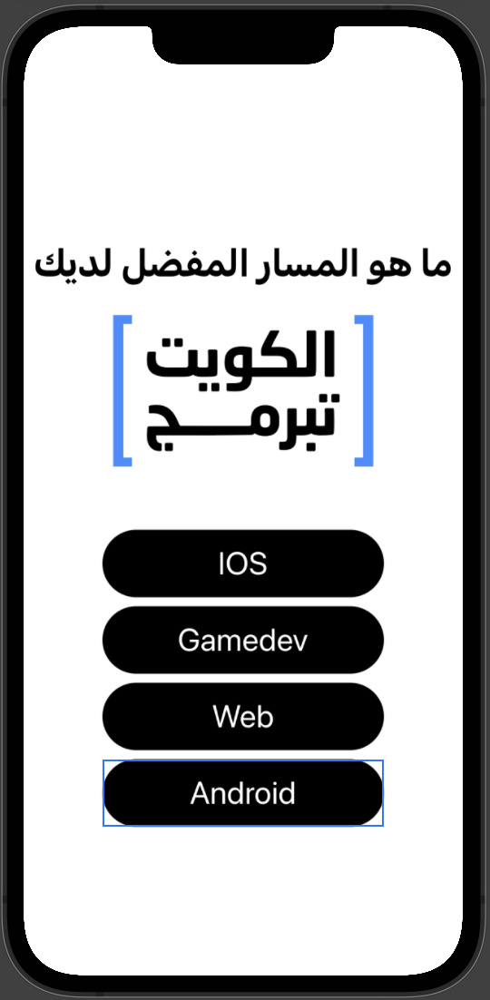

# OnTapGesture

<p dir="rtl">
فيديوهات الدرس</p>


* رابط الفيديو [OnTapGesture](https://www.youtube.com/watch?v=qgtG5zbufy4) 


---


# <p dir="rtl">
شرح الدرس </p>


# <p dir="rtl">
طريقة تغيير متغير variable باستخدام OnTapGesture</p>


* نستخدم متغير من نوع  State  لمعرفة إذا تغيرت قيمة المتغير مثل المثال التالي

```
@State var color = "green"
```


* نقوم بإضافة جملة في Text لرؤيتها

```
VStack {
         Text("My favourite color is " , color)
             .padding() }
```


 
* نقوم بإنشاء Text جديد واضافة OnTapGesture لتغير اللون الاخضر الى اللون الازرق 

```
Text("Blue")
     .padding()
     .foregroundColor(.blue)
     .onTapGesture {
          color = "Blue"
     }
 
```


---

<p dir="rtl">
تمرين

<p dir="rtl">
في هذا التمرين سنقوم ببناء تطبيق الهاتف </p>


1.  قم بإنشاء مشروع جديد باسم Best Track
2. قم بإدراج 4 مسارات في الشاشة  على الشكل التالي


<p dir="rtl">

</p>


<p dir="rtl">
    
3. عند الضغط على اي مسار يقوم بإظهارها ايقونه المسار  مثال: 


<p dir="rtl">

</p>


<p dir="rtl">
<strong>بونص: قم بتغير خلفية النصوص إلى الاوان التالية</strong></p>


<p dir="rtl">

</p>

